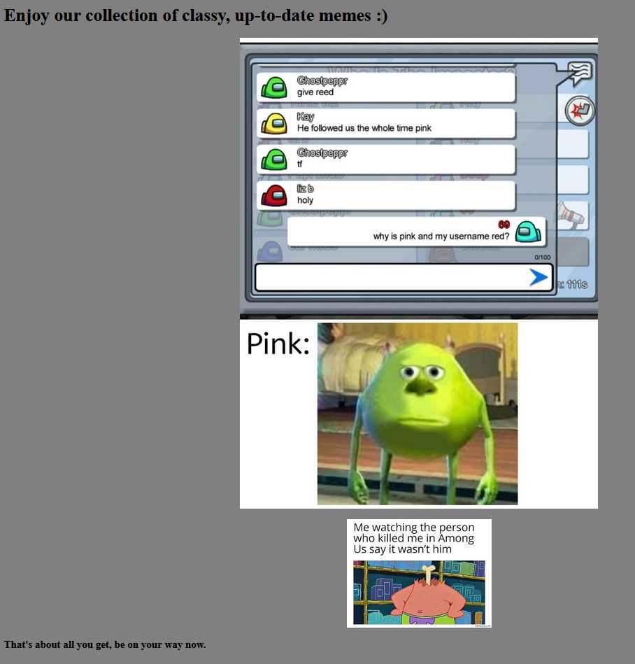
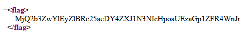

# Where's the Body?

This is a warmup challenge that just had a simple static page with a few memes on it:

The page source didn't reveal anything interesting. But this was in `sitemap.xml`:

`MjQ2b3ZwYlEyZlBRc25aeDY4ZXJ1N3NIcHpoaUEzaGp1ZFR4WnJr` Base64 decodes to `246ovpbQ2fPQsnZx68eru7sHpzhiA3hjudTxZrk` which Base58 decodes to `flag{yellow_is_the_imp0ster}`.